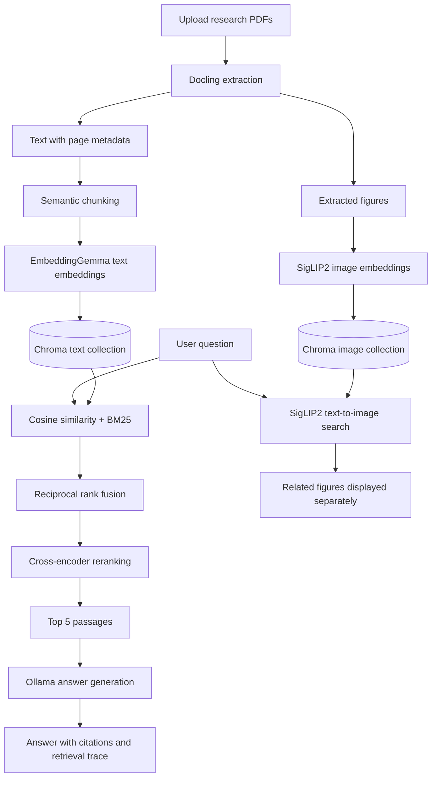

# Research Paper Assistant

A retrieval-augmented generation (RAG) application for asking questions about research PDFs and inspecting the evidence behind each answer. Built with Python, Streamlit, Docling, ChromaDB, Sentence Transformers, and Ollama.

Upload papers, ask a specific question, and receive an answer with source references such as `[S1]`. The interface exposes the retrieved passages, page numbers, ranking scores, and related figures. A separate evaluation notebook compares retrieval strategies against a reproducible question-answer benchmark.

## Engineering highlights

- **Document processing:** PDF text and figure extraction with page-level provenance.
- **Semantic chunking:** embedding-based topic boundaries with a hard word limit to control context size.
- **Hybrid retrieval:** exact cosine similarity and BM25 combined through reciprocal rank fusion (RRF).
- **Cross-encoder reranking:** query-passage scoring to select the final answer context.
- **Inspectable answers:** source citations, candidate-level diagnostics, and timings for retrieval, reranking, and generation.
- **Evaluation:** a controlled comparison of vector search, hybrid search, and hybrid search with reranking, including retrieval and answer-quality metrics.

## Architecture



### 1. Loading and indexing

[`utilities/DataLoader.py`](utilities/DataLoader.py) uses Docling to process every extracted text and picture item in a PDF. Text retains its page number; figures are saved as PNG files under `extracted_images/`. The parser finishes extraction before constructing chunks, including text that appears after figures.

[`utilities/Embed.py`](utilities/Embed.py) embeds text with `google/embeddinggemma-300m` and figures with `google/siglip2-base-patch16-224`, as configured in `.env.example`. Downloaded embedding models are saved under `models/`, with file locks and completion markers to avoid loading partially saved models.

[`utilities/Database.py`](utilities/Database.py) persists records in separate `text_embeddings` and `image_embeddings` Chroma collections. Metadata includes the paper path, start/end page, chunk index, and ingestion version. Indexing prepares embeddings before writing, upserts records in batches, and removes stale records after both collections accept the new data. Re-uploading the same paper path replaces its indexed records. Chroma writes across the two collections are not transactional.

### 2. Semantic chunking

The chunker operates on Docling text elements, which can contain more than one sentence:

1. Build a contextual window around each text element using neighboring extracted items (`BUFFER_SIZE=1` by default); only text is included in the window.
2. Embed each contextual window and calculate cosine distance between adjacent text elements.
3. Split where distance exceeds the document's configured percentile (`BREAKPOINT_PERCENTILE_THRESHOLD=80`).
4. Enforce `MAX_CHUNK_WORDS=400`, splitting oversized text elements at word boundaries without dropping words.
5. Flush the current text chunk at each figure and store the figure separately. Preserve the start and end page of each text chunk.

Semantic boundaries aim to keep related material together, while the word cap bounds the amount of text passed downstream. The contextual buffer helps detect boundaries; it does not add overlapping text to the resulting chunks.

### 3. Retrieval and reranking

[`utilities/Retrieval.py`](utilities/Retrieval.py) retrieves using the original question. Each query reads a fresh snapshot of indexed text and embeddings so newly uploaded papers are immediately searchable.

| Stage | Implementation | Purpose |
| --- | --- | --- |
| Dense ranking | Exact cosine similarity over stored text vectors | Match semantic meaning |
| Lexical ranking | BM25 with `k1=1.5`, `b=0.75` | Match specific terminology, identifiers, and keywords |
| Fusion | Weighted RRF, equal dense/lexical weights, `rrf_k=60` | Combine rankings without mixing incompatible score scales |
| Candidate selection | By default, up to 30 results from each ranking feed fusion; the top 20 fused candidates are retained | Build the reranking pool |
| Reranking | `cross-encoder/ms-marco-MiniLM-L6-v2` | Score the question and each candidate passage jointly |
| Final context | Top 5 reranked passages by default | Supply focused evidence for answer generation |

The reranker truncates each query-passage pair to 512 tokens for scoring, while preserving the original passage for generation. Its scores are relevance signals, not probabilities. If reranking fails, the app displays a warning and uses the hybrid ranking.

Figure retrieval uses SigLIP2 to encode the question into the same space as the indexed images and displays up to three related figures. **Figures are supplementary UI results; they are not passed to the answer model as evidence.**

### 4. Answer generation and observability

[`utilities/LLM.py`](utilities/LLM.py) sends the current question, selected evidence, and at most ten prior chat messages to Ollama. The prompt asks the model to cite supplied source IDs, acknowledge missing evidence, and treat retrieved text as data rather than instructions. Generation uses temperature `0`. These are grounding instructions, not a guarantee that every answer or citation is correct.

The Streamlit interface exposes source passages and a retrieval trace containing every candidate's cosine, BM25, RRF, and reranking scores; changes in rank; the final context IDs; and stage timings. Diagnostics are stored separately from conversation history so verbose traces do not become future LLM context.

## Run the application

### Prerequisites

- Python **3.12**; the development environment uses Python 3.12.10.
- Ollama installed and running, with an answer model available locally.
- Hugging Face access for the configured embedding models, including acceptance of any required model terms.
- Internet access for initial model downloads and sufficient disk space for model weights. CPU execution is supported; GPU use depends on the installed PyTorch build and hardware.

The commands below target **Windows PowerShell**, matching the repository's environment. `requirements.txt` includes the Windows-specific `pywin32` dependency, so it is not an unchanged cross-platform installation file.

### 1. Create the Python environment

Open a terminal in the project root (the folder containing `Homepage.py`):

```powershell
py -3.12 -m venv .venv
.\.venv\Scripts\python.exe -m pip install --upgrade pip
.\.venv\Scripts\python.exe -m pip install -r requirements.txt
```

Commands use the virtual environment's executables directly, so activation is optional.

### 2. Configure the application

Create `.env` if it does not already exist:

```powershell
if (-not (Test-Path .env)) { Copy-Item .env.example .env }
```

The supplied configuration is:

```dotenv
TEXT_EMBEDDING_MODEL="google/embeddinggemma-300m"
IMAGE_EMBEDDING_MODEL="google/siglip2-base-patch16-224"
BUFFER_SIZE=1
BREAKPOINT_PERCENTILE_THRESHOLD=80
CHROMA_DB_PATH="chroma_db"
OLLAMA_MODEL="gemma4:e4b"

# Used by the evaluation notebook only.
OLLAMA_CLOUD_MODEL=gemma4:31b-cloud
OLLAMA_CLOUD_BASE_URL=https://ollama.com
OLLAMA_CLOUD_API_KEY=
```

Authenticate before starting Streamlit so model loading does not need an interactive login inside the app:

```powershell
.\.venv\Scripts\hf.exe auth login
```

The app loads both text and image embedding models at startup. Initial startup and PDF processing can take longer while models are downloaded and cached. The cloud API key is not required for the chat application.

### 3. Prepare Ollama

With Ollama running, download the model named by `OLLAMA_MODEL`:

```powershell
ollama pull gemma4:e4b
ollama list
```

If the Ollama service is not already running, start `ollama serve` in a separate terminal. If you use another compatible answer model, pull that model and update `OLLAMA_MODEL` to its exact name.

### 4. Launch and try a paper

```powershell
.\.venv\Scripts\python.exe -m streamlit run Homepage.py
```

Open the local URL printed by Streamlit (normally `http://localhost:8501`).

1. Attach one or more PDFs through the chat input and submit them.
2. Wait for the indexing confirmation. A question submitted with attachments is answered after those files are indexed.
3. Ask a focused question, for example: "What training objective does the proposed method use?"
4. Expand **Retrieved sources** to inspect passages and page numbers, and **Retrieval details** to inspect candidate rankings and timings.

Uploads are stored in `uploads/`, extracted figures in `extracted_images/`, and the index in `CHROMA_DB_PATH`. Indexed documents persist across restarts; chat history belongs to the Streamlit session. Files placed in `input/` are for the evaluation notebook and are not automatically indexed by the app.

### Optional tuning

Add these variables to `.env` to override the code defaults, then restart the app:

| Variable | Default | Effect |
| --- | --- | --- |
| `MAX_CHUNK_WORDS` | `400` | Maximum words per text chunk |
| `RETRIEVAL_TOP_K` | `5` | Passages supplied to the answer model |
| `RERANK_CANDIDATES` | `20` | Hybrid candidates scored by the reranker |
| `RERANKER_MODEL` | `cross-encoder/ms-marco-MiniLM-L6-v2` | Model ID or local model directory |
| `RERANKER_DEVICE` | `cpu` | Reranker execution device |
| `RERANKER_BATCH_SIZE` | `8` | Query-passage pairs scored per batch |

Require `1 <= RETRIEVAL_TOP_K <= RERANK_CANDIDATES`. Changes to chunking settings require re-uploading papers. When changing embedding models, use a new `CHROMA_DB_PATH` and re-index the PDFs so stored and query embeddings use the same model.

## Evaluation

[`answer_evaluation.ipynb`](answer_evaluation.ipynb) runs a standalone benchmark on PDFs from `input/`. It freezes an isolated corpus snapshot and does not read or modify the app's Chroma database.

### Experimental design

The notebook compares three systems using the same corpus, questions, answer model, and final context size of five passages:

| System | Retrieval configuration |
| --- | --- |
| Basic Vector RAG | Dense cosine ranking only |
| Hybrid RAG | Cosine + BM25 with RRF |
| Hybrid + Reranker | Hybrid candidates followed by cross-encoder reranking |

Ollama Cloud generates synthetic questions and reference answers from source passages. Evidence spans are selected by ID and copied directly from source text, then validated. Each question records relevant chunk IDs, evidence quotes, source metadata, and a `reviewed` flag. Reference answers are supplied to the judge but never to the answer-generation model.

### Metrics

| Metric | Definition |
| --- | --- |
| Recall@5 | Fraction of labeled relevant chunks present in the first five retrieved results |
| MRR | Mean reciprocal rank of the first labeled relevant result within the first five; zero if absent |
| Faithfulness | Cloud judge estimate, from 0 to 100, of factual claims supported by retrieved evidence |
| Citation correctness | Cloud judge estimate, from 0 to 100, of cited claims supported by their cited sources; N/A when the answer has no citations |

Validated cloud responses are cached, transient failures are retried, and per-system results are checkpointed. A resumed run can reuse generated answers and completed judgments. Summary metrics use only questions successfully completed by all three systems, avoiding comparisons over different question sets.

The default is a **five-question pilot** with seed `42`. Synthetic labels need human review, relevance labels may miss other valid passages, and using the same cloud model for question generation and judging may introduce bias. The `reviewed` flag is reported but does not exclude unreviewed questions automatically. A pilot run does not establish that one system is generally superior.

### Evaluation results (saved pilot run)

The saved outputs in [`answer_evaluation.ipynb`](answer_evaluation.ipynb) report the following results for run `a30484d95f02f068`. These are recorded notebook results, not a newly executed benchmark.

- **Corpus:** 16 PDFs, producing 1,659 text chunks.
- **Evaluation set:** 5 synthetic questions; all 5 completed successfully across all three systems (15 evaluated answers).
- **Models:** `gemma4:e4b` for answer generation and `gemma4:31b-cloud` for question generation and judging.
- **Review status:** 0 of 5 questions human-reviewed. Each system produced 5 scored answers with citations.

| System | Recall@5 | MRR | Faithfulness (judge) | Citation correctness (judge) |
| --- | ---: | ---: | ---: | ---: |
| Basic Vector RAG | 80% | 0.80 | 100% | 100% |
| Hybrid RAG | 100% | 0.87 | 100% | 100% |
| Hybrid + Reranker | 100% | 0.90 | 100% | 100% |

In this pilot, hybrid retrieval increased Recall@5 by **20 percentage points** over vector-only retrieval. Reranking retained 100% Recall@5 and increased MRR from **0.87 to 0.90** (rounded). For question `Q002`, hybrid search recovered the labeled evidence at rank 3 after vector search missed it in the top five; reranking moved it to rank 1. Reranking also moved `Q001`'s labeled evidence from rank 1 to rank 2, so the aggregate gain includes a per-question tradeoff.

The 100% faithfulness and citation scores are the cloud judge's assessments on this small, unreviewed sample; they do not establish perfect answer accuracy. Retrieval metrics track labeled evidence, while the judge evaluates the supplied context, so their scores can differ. Broader claims require a larger, human-reviewed benchmark.

### Run the benchmark

1. Complete the application setup and keep the local Ollama answer model available.
2. Create `input/` and place the research PDFs to evaluate directly inside it. The notebook discovers `input/*.pdf`.
3. Set `OLLAMA_CLOUD_API_KEY`, `OLLAMA_CLOUD_MODEL`, and `OLLAMA_CLOUD_BASE_URL` in `.env`. This workflow sends document excerpts, questions, and answers to the configured cloud endpoint.
4. Open `answer_evaluation.ipynb` in VS Code with a Jupyter-capable extension and select `.venv` as the kernel. Alternatively, install and launch JupyterLab from the project root:

   ```powershell
   .\.venv\Scripts\python.exe -m pip install jupyterlab
   .\.venv\Scripts\python.exe -m jupyterlab answer_evaluation.ipynb
   ```

5. Adjust `NUM_QUESTIONS`, `RANDOM_SEED`, and `CANDIDATE_COUNT` in the setup cell if needed. The notebook's candidate count is independent of the app's `RERANK_CANDIDATES` setting.
6. Run cells through ground-truth generation. Review `evaluation_artifacts/input_qa_benchmark/ground_truth.json`, correct questions or answers as needed, add verified relevant chunks with matching evidence quotes, and set accepted entries to `"reviewed": true`.
7. Continue through label validation, evaluation, and summary cells. Inspect completion counts and failures alongside the metrics.

Outputs are stored under `evaluation_artifacts/input_qa_benchmark/`:

| Artifact | Contents |
| --- | --- |
| `input_manifest.json` | PDF hashes and model/chunking settings |
| `corpus_snapshot.json` | Frozen passages, metadata, and embeddings |
| `ground_truth.json` | Questions, reference answers, evidence, and review status |
| `results_<run_id>.json` | Settings, retrieved context, answers, judgments, and errors |
| `summary_<run_id>.csv` | Comparable per-system mean metrics |
| `cloud_cache/`, `pdf_cache/` | Reusable validated responses and extraction results |
| `generation_failures.json`, `judge_failures/` | Generation and judgment diagnostics |

Choose a new notebook `OUTPUT_DIR` when changing PDFs or model/chunking settings; snapshot reuse rejects a changed input manifest. Existing ground truth is reused rather than regenerated, so choose a new output directory for a fresh question set too. Evaluation artifacts and input documents are excluded from Git by default.

## Tests

Run the existing regression suite from the project root:

```powershell
.\.venv\Scripts\python.exe -m unittest discover -s tests -v
```

Tests cover extraction after figures, chunk size and text preservation, hybrid ranking, duplicate handling, re-indexing, reranker behavior and fallback, bounded chat history, diagnostics, upload-before-query ordering, and evaluation validation/resume logic. They use mocks, injected embeddings, and ephemeral Chroma collections to avoid model downloads, cloud calls, and writes to the application database.

## Project structure

```text
Research Assistant/
|-- Homepage.py                  # Streamlit upload, chat, sources, and diagnostics
|-- utilities/
|   |-- DataLoader.py            # Docling extraction and semantic chunking
|   |-- Embed.py                 # Text/image embeddings and model caching
|   |-- Database.py              # Persistent Chroma collections and indexing
|   |-- Retrieval.py             # Cosine, BM25, and reciprocal rank fusion
|   |-- Reranking.py             # Cross-encoder scoring
|   |-- LLM.py                   # Evidence-grounded Ollama generation
|   `-- Diagnostics.py           # Retrieval traces and UI rendering
|-- answer_evaluation.ipynb      # Three-system benchmark
|-- tests/                       # Pipeline and notebook regression tests
|-- requirements.txt
|-- .env.example
`-- Readme.md
```

## Current scope and troubleshooting

- **Scanned PDFs and tables:** OCR and table-structure extraction are disabled. Use PDFs with extractable text; structured table understanding is not implemented.
- **Corpus size:** text retrieval scans all stored vectors and recomputes BM25 per question. This keeps the implementation inspectable for a local paper collection but is not designed for large-scale search.
- **Document selection:** questions search all indexed papers; there is no per-paper search filter in the UI. Re-uploading the same filename targets the same upload path.
- **Model access errors:** authenticate with Hugging Face and confirm access to the configured repositories. Both embedding models are required at app startup.
- **Ollama connection or model errors:** confirm the service is running and the exact `OLLAMA_MODEL` name appears in `ollama list`.
- **Embedding mismatch:** select a fresh `CHROMA_DB_PATH` and upload the papers again after changing embedding models.
- **Reranker unavailable:** the app continues with hybrid search and shows a warning. Check model access and device settings to restore reranking.
- **Evaluation errors:** check cloud credentials, endpoint/model access, and saved diagnostics. Rerun the evaluation cell to resume incomplete records.
